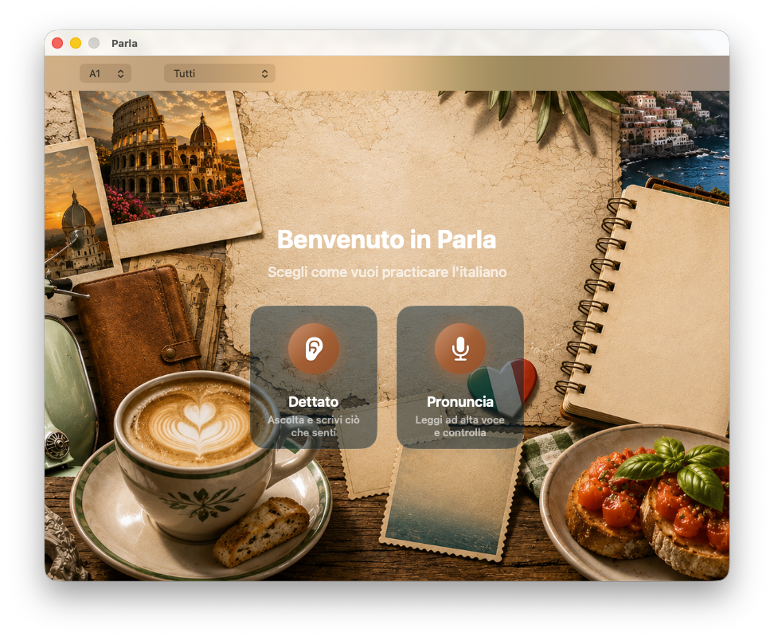

# Parla

Parla is a simple macOS app for practicing Italian with short phrases.

You can choose a level, pick a topic, and practice in two modes:

- **Dettato** - listen to an Italian phrase and type what you hear.
- **Pronuncia** - read the phrase out loud and compare your pronunciation.



## Requirements

- macOS 14 or newer
- Xcode Command Line Tools / Swift 5.9+
- Microphone permission for pronunciation practice
- Internet connection the first time pronunciation mode downloads the speech model

## Run the app

From this folder:

```bash
./build-app.sh
open Parla.app
```

You can also run it directly with Swift:

```bash
swift run Parla
```

## How to use

1. Choose a difficulty: **A1**, **A2**, or **B1**.
2. Choose a topic, or leave it as **Tutti** for all topics.
3. Pick **Dettato** or **Pronuncia**.
4. Complete each phrase:
   - In **Dettato**, listen, type the phrase, then press **Conferma**.
   - In **Pronuncia**, press the microphone, speak, then stop recording.
5. Use **Riprova** to try again or **Prossima** to continue.

Parla saves completed phrases locally on your Mac.
